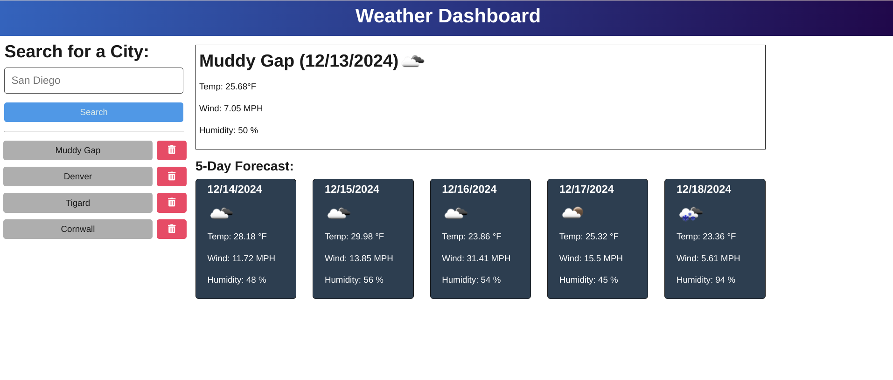

# WeatherOrNot 

## Description

__Weather or Not__ is an [Express.js](https://expressjs.com/) app that uses the [OpenWeather API](https://openweathermap.org/api) to display a city's current weather details and the 5-day forecast. This [Weather Or Not](https://weatherornot-j0iy.onrender.com/) project is built and hosted on [Render](https://render.com/). It uses [Vite](https://vite.dev/) to facilitate development builds.

## Table of Contents

- [Installation](#installation)
- [Usage](#usage)
- [License](#license)
- [Contributing](#contributing)
- [Tests](#tests)
- [Questions](#questions)

## Installation

1. Change the project's root directory  
2. Install the dependency modules: npm install  
3. Build using: npm run build

## Usage

For the Development environment:  
1. Add these environment variables to server/.env:  
	API_BASE_URL=https://api.openweathermap.org  
	API_KEY=&lt;generate an OpenWeather development api key to use here&gt;  
2. Run the environment: npm run start:dev  
  
For a production deployment on Render:  
1. Set the environment variables in the cloud environment:  
	API_BASE_URL=https://api.openweathermap.org  
	API_KEY=&lt;generate an OpenWeather production api key to use here&gt;  
2. Run the build: npm run render-build  
3. Start the app: npm run start  
Visit the [Weather Or Not](https://weatherornot-j0iy.onrender.com/) site to see it in action!  
 

## License

This application is covered under the [MIT](https://opensource.org/licenses/MIT) license

## Contributing

Guidelines:  
Ensure your code follows the project's coding standards.  
Write clear and concise commit messages.  
If your changes include new features, please update the documentation accordingly.  
If you are fixing a bug, please include a test to verify the fix.  
  
Thank you for your contributions!  
  
Thanks to [Justin Moore](https://github.com/Jmo5896) for help with a deployment issue and some of the data formatting.

## Tests

Test instructions:  
1. Try entering a valid city name.  
2. Try entering an invalid city name  
Note that the OpenWeather API appears to handle fuzzy lookups, but an example of an invalid city is: !!!.  
3. Support open source using [Insomnia](https://insomnia.rest/) to investigate the Weather REST API.

## Questions

If you have any questions, feel free to reach out: 
- GitHub: [clintsrc](https://github.com/clintsrc)  
- Email: clinton.alan.jones@gmail.com

